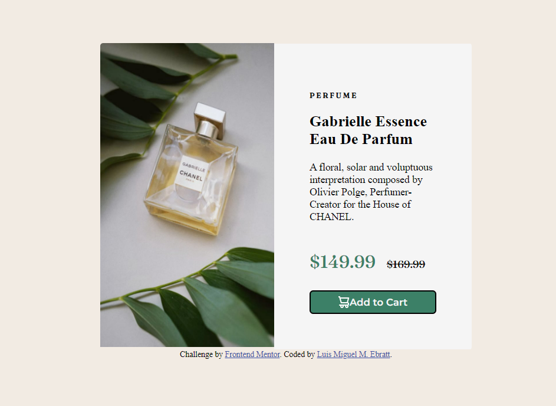
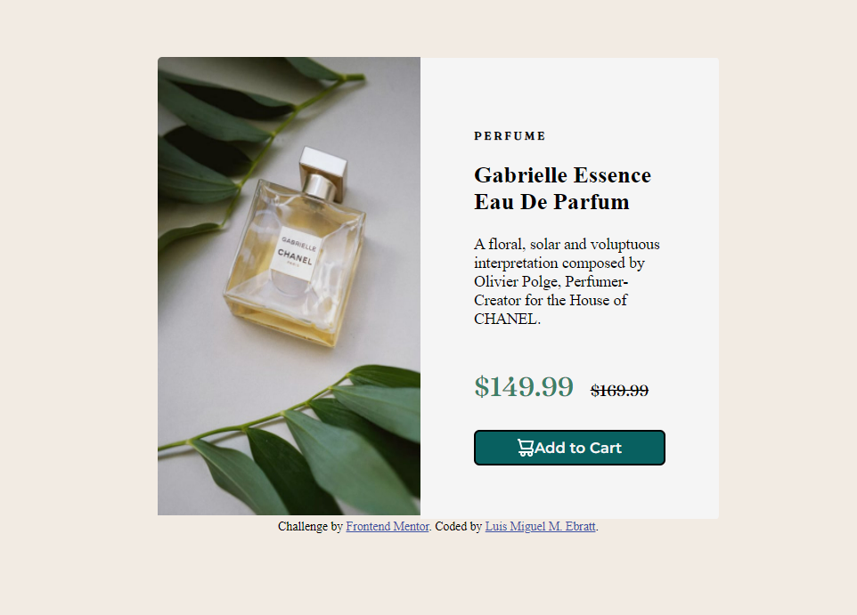
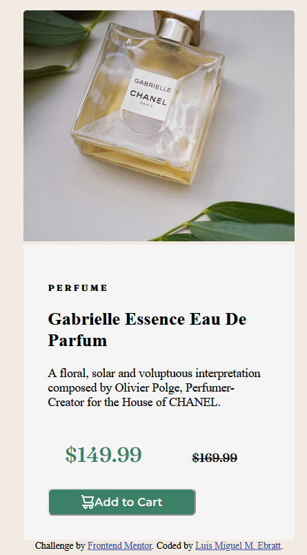

# Frontend Mentor - Product preview card component solution

This is a solution to the [Product preview card component challenge on Frontend Mentor](https://www.frontendmentor.io/challenges/product-preview-card-component-GO7UmttRfa). Frontend Mentor challenges help you improve your coding skills by building realistic projects. 

## Table of contents

- [Overview](#overview)
  - [The challenge](#the-challenge)
  - [Screenshot](#screenshot)
  - [Links](#links)
- [My process](#my-process)
  - [Built with](#built-with)
  - [What I learned](#what-i-learned)
  - [Continued development](#continued-development)
- [Author](#author)

## Overview

### The challenge

Users should be able to:

- View the optimal layout depending on their device's screen size
- See hover and focus states for interactive elements

### Screenshot

- Desing preview on desktop:



- Desing preview activate on desktop:



- Desing preview on mobile:



### Links

- Solution URL: [Frontendmentor.io](https://www.frontendmentor.io/challenges/product-preview-card-component-GO7UmttRfa/hub/product-preview-card-component-solution-WRWbC144bX)
- Live Site URL: [Product-preview-card-solution](https://lmebratt.github.io/product-preview-card/)

## My process

### Built with

- Semantic HTML5 markup
- CSS custom properties
- Flexbox
- CSS Grid
- JavaScript
- Mobile-first workflow

### What I learned

Code samples:

```html
<picture>
  
</picture>
```
```css
.card {
    display: flex;
    align-items: center;
    flex-direction: row;
    align-content: center;
    margin-top: 100px;
    border-radius: 4px;
    width: 504px;
    overflow: hidden;
}
```
```js
let buy = document.getElementById("buy")

function select(params) {
    buy.style.background = "#086060"
}

buy.addEventListener("click", select)
```

### Continued development

This is just the beginning, I will continue to strengthen my knowledge to become a Full Stack Web Developer.

## Author

- Website - [Luis M. Ebratt](https://lmebratt.github.io/)
- Twitter - [@RazorLm](https://twitter.com/RazorLm)
- Frontend Mentor - [@lmebratt](https://www.frontendmentor.io/profile/lmebratt)
